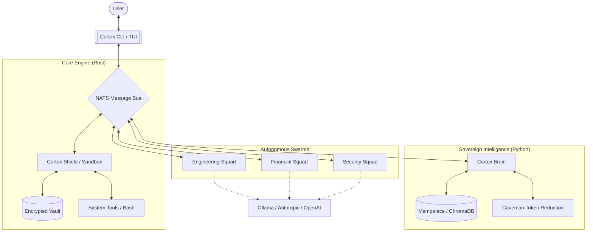

# 🧠 Cortex OS

> **The Autonomous AI Operating System.**
> Uncensored. Sovereign. Plug & Play.

---

## What is Cortex OS?

Cortex OS is a **unified, from-scratch** autonomous AI runtime, designed as a superior, extensible alternative to tools like Claude Code and OpenDevin. It operates natively in your terminal with advanced multi-agent capabilities.

- **Sandboxed execution** of code and shell commands (Rust)
- **Native Mempalace Integration**: Persistent semantic memory with verbatim recall, dramatically reducing token context window bloat compared to standard chat platforms.
- **Multi-Agent Swarms (Squads)**: Define specialized squads (e.g., Financial Analysts or Full-Stack Engineering teams) that work in parallel on complex domains using modern stacks (JS/TS, Rust, Go, Python, C++).
- **Model Flexibility**: Built Open-Source first (Ollama, Qwen, Llama), but fully compatible with **Anthropic, OpenAI, Gemini, and Groq** APIs via native Token Reduction systems to keep costs low.
- **Secrets Vault**: AES-256-GCM encrypted environment — API keys never touch disk in plain text.
- **Circuit Breaker**: Self-healing health monitor that halts agents if LLM infrastructure goes down.
- **Beautiful interfaces** — both TUI (terminal) and Web dashboard

One binary. One `docker compose up`. Done.

## 🏛️ Strategic Vision

Cortex OS is built on the premise that AI should be a **sovereign extension of the user**, not a rented service. While other tools focus on simple code generation, Cortex is designed as a **Local-First Autonomous Engine** that manages complex, multi-domain workflows through parallelized expertise.

### Why Cortex?
- **Zero Token Waste**: Native Mempalace integration and heuristic compressors ensure you only send essential data to expensive APIs.
- **Privacy First**: With the AES-256 Secrets Vault and local Ollama support, your strategic data never leaves your infrastructure unless you explicitly route it.

## 🧬 Sovereign Swarm Architecture



Cortex OS doesn't just run tasks; it orchestrates a distributed nervous system:
1. **The Brain (cortex-memory)**: A Python-based semantic engine that manages long-term memory, knowledge graphs, and context compression.
2. **The Backbone (NATS)**: A high-performance message bus that allows components (CLI, TUI, Gateway, Agents) to communicate with sub-millisecond latency.
3. **The Shield (cortex-core)**: A Rust-based execution layer that enforces strict permissions, handles sandboxed tool execution, and secures your API secrets.
4. **The Swarm (Agents)**: A modular ecosystem of domain-specific agents that can be dynamically scaled and reassigned to different squads.
### 🧠 The Philosophy: Local-First Sovereignty
Most AI platforms are "Cloud-First," meaning your data is a guest in their house. Cortex OS is **"Local-First,"** meaning the LLM is a guest in *your* house. By orchestrating local Ollama instances with secure tunnels to external providers (Anthropic/OpenAI), Cortex gives you the best of both worlds: extreme speed and privacy for daily tasks, and high-order reasoning for complex architecture.

## 🚀 Key Features

| Feature | Description | Status |
| :--- | :--- | :--- |
| **Encrypted Vault** | AES-256-GCM storage for all sensitive API keys. | ✅ Production |
| **Caveman Compression** | Native token-reduction algorithms for LLM context. | ✅ Production |
| **Health Circuit Breaker** | Automatically halts agents if LLM backends fail. | ✅ Production |
| **Swarm Orchestration** | Domain-specific agent squads (FinOps, Eng, Sec). | ✅ Production |
| **Sovereign Memory** | Long-term vector storage via ChromaDB. | ✅ Production |
| **Graceful Shutdown** | Coordinated SIGINT handling for all subsystems. | ✅ Production |


```
cortex-os/
├── cortex-core/        # Rust lib — execution runtime, tools, sandbox, vault, health
├── cortex-cli/         # Rust bin — interactive REPL + NATS daemon + vault commands
├── cortex-tui/         # Rust bin — Ratatui terminal dashboard
├── cortex-gateway/     # Rust bin — multi-channel gateway (Discord, Telegram)
├── cortex-memory/      # Python — semantic memory, knowledge graph, LLM brain
├── agents/             # Agent configs, tools, and squad definitions
│   ├── architect/          # Software Architect agent
│   ├── software-engineer/  # Full-Stack Engineer agent (linter tools)
│   ├── devops/             # DevOps agent (Dockerfile validation)
│   ├── cyber-security/     # Security Auditor agent
│   ├── market-analyst/     # Technical Analyst (Binance ticker tools)
│   ├── fundamental-researcher/ # Macro Economist agent
│   ├── risk-manager/       # Capital allocation & risk management
│   └── squads/             # Squad orchestration definitions
├── web/                # React+Vite — web dashboard
├── docker-compose.yml  # NATS + Ollama + ChromaDB
├── setup.sh            # One-liner installer
├── Dockerfile          # Multi-stage production build
└── Cargo.toml          # Rust workspace root
```

## Quick Start

```bash
# Option 1: One-liner install
curl -sSL https://raw.githubusercontent.com/virgilhawkins00/cortex-os/main/setup.sh | bash

# Option 2: Manual
git clone git@github.com:virgilhawkins00/cortex-os.git
cd cortex-os

# Start infrastructure
cp .env.example .env
docker compose up -d
docker exec cortex_ollama ollama pull dolphin-mistral:latest

# Build and run
cargo build --workspace --release
./target/release/cortex
```

### Vault Setup (Recommended)

```bash
# Initialize encrypted vault for API keys
./target/release/cortex vault init

# Store secrets securely (AES-256-GCM encrypted)
./target/release/cortex vault set ANTHROPIC_API_KEY sk-ant-...
./target/release/cortex vault set OPENAI_API_KEY sk-...
./target/release/cortex vault set GEMINI_API_KEY AIza...

# On next boot, Cortex auto-detects .env.vault and prompts for master password
./target/release/cortex
# > Vault found. Enter Master Password to boot Cortex OS: ****
```

## Tech Stack

| Layer | Tech | Purpose |
|---|---|---|
| Execution | Rust (tokio, async) | Tool registry, sandbox, permissions, squad orchestration |
| Memory | Python (ChromaDB, SQLite) | Mempalace, semantic search, Caveman token compression |
| Bus | NATS | Component communication & real-time telemetry |
| LLM | Ollama / Anthropic / OpenAI / Gemini / Groq | Local uncensored inference + optimized paid API routing |
| Security | AES-256-GCM + PBKDF2 | Secrets Vault, mTLS, audit logging |
| Reliability | CancellationToken + Circuit Breaker | Graceful shutdown, health monitoring |
| TUI | Ratatui | Terminal dashboard with Swarm visualization |
| Web | React + Vite | Web dashboard |

## License

MIT — [@virgilhawkins00](https://github.com/virgilhawkins00)
